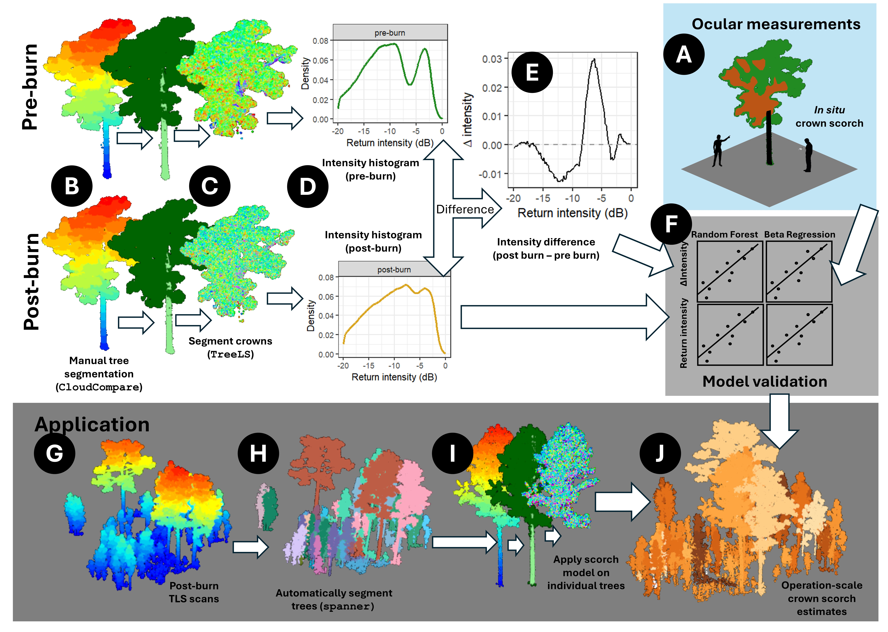
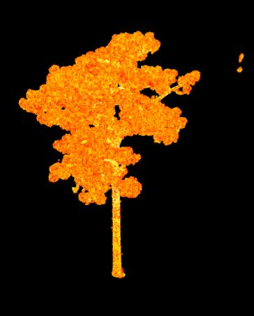
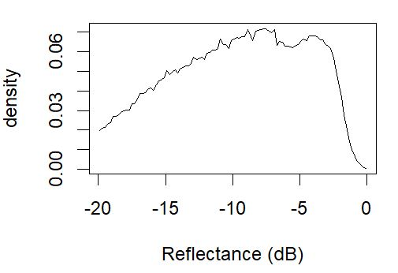
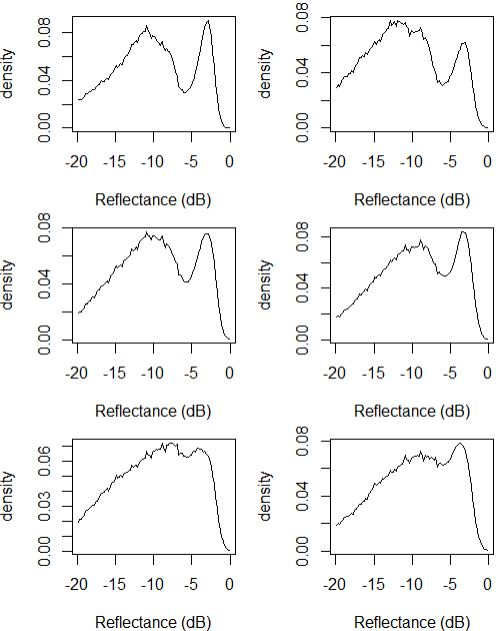

# CrownScorchTLS 

 [](https://doi.org/10.5281/zenodo.17380262)

This `R` package contains functions to predict crown scorch from Terrestrial Lidar scans acquired with a RIEGL vz400i, following methods in [Cannon et al. 2025](https://doi.org/10.1186/s42408-025-00420-0)

Citation

Cannon, Jeffery B., Nicole E. Zampieri, Andrew W. Whelan, Timothy M. Shearman, Andrew J. Sánchez Meador, and J. Morgan Varner. “Terrestrial Lidar Scanning Provides Efficient Measurements of Fire-Caused Crown Scorch in Longleaf Pine.” **Fire Ecology** 21, no. 1 (2025): 71. https://doi.org/10.1186/s42408-025-00420-0.

The core functionality is to automatically

1.  Isolate crowns of individual trees by removing tree boles from `LAS` objects using `TreeLS::stemPoints`
2.  Generates histograms of relative reflectance to generate predictor variables for model prediction.
3.  Applys a `randomForest` model from Cannon et al. 2025 to estimate crown scorch

 Fig. 1. Schematic methodology for estimating canopy scorch volume using terrestrial lidar scans trained on (A) ocular scorch measurements. We (B) manually segmented pre- and post-burn trees for training, (C) isolated crowns, and (D) generated histograms of return intensity. We (E) calculated Δ intensity from changes in pre- and post-burn histograms, and (F) combined these with training data to model canopy scorch using random forests and beta regression. In application, (G) scanned areas can be (H) automatically segmented, (I) crowns isolated and prediction model applied, resulting in (J) individual crown scorch estimates at an operational scale.

## Install required packages

Get the latest released version of `CrownScorchTLS` from github

``` r
install.packages('remotes')
remotes::install_github('jbcannon/CrownScorchTLS')
```

You will also need `lidR` and `randomForest` packages from CRAN, and the `TreeLS` package from github.

``` r
install.packages('lidR')
install.packages('randomForest')
remotes::install_github('tiagodc/TreeLS')
```

Load required packages after installing

``` r
library(lidR)
library(CrownScorchTLS)
```

## Workflow Part 1: Predict Scorch with Cannon et al. 2025 model

### Load individual tree as `LAS`

Load a `LAS` object representing a post-burn scan of an individual tree. The recommended time since burn is 15-20 days. Model predictions are based on relative intensity from a RIEGL vz400i terrestrial lidar scanner

``` r
las_file = system.file('extdata', 'tree_005.laz', package = 'CrownScorchTLS')
las = readLAS(las_file)
plot(las, color='Intensity')
```

 Fig. 2. `LAS` representation of Pinus palustris tree D-03-10867 from Cannon et al. 2025, approximately 2 weeks after prescribed burn

### Generate reflectance histogram (optional)

Generate a histogram based on reflectance intensites to be used in `randomForest` prediction

``` r
crown = remove_stem(las)
crown = add_reflectance(crown) # add reflectance since its missing
histogram = get_histogram(crown)
plot(density ~ intensity, data = histogram, xlab='Reflectance (dB)', type='l')
```

 Fig. 3. Histogram of relative reflectance of Pinus palustris crown D-03-10867 from Cannon et al. 2025, approximately 2 weeks after prescribed burn

### Predict scorch from `LAS` object

Predict scorch from post-burn `LAS` object using `randomForest` model from Cannon et al. 2025

``` r
predict_scorch(las)
```

Model output

```         
predicted_scorch
0.9402951
```

### Estimate scorch on multiple trees

The `CrownScorchTLS` package contains data from six example trees following Cannon et al. 2025 (Figure 3). They can be accessed from the `extdata` directory in the package

``` r
directory = system.file('extdata', package = 'CrownScorchTLS')
filenames = list.files(directory, pattern='.laz', full.names=TRUE)

# Run loop to plot all histograms
par(mfrow = c(3,2), mar = c(4,4,1,1))
for(f in filenames) {
  las = readLAS(f)
  scorch = suppressMessages(predict_scorch(las, plot=TRUE))
  cat('file:\t', basename(f), '\t', 'scorch:\t', round(scorch,3),'\n')
}
```

Model output:

```         
file:    tree_001.laz    scorch:     0.051 
file:    tree_002.laz    scorch:     0.035 
file:    tree_003.laz    scorch:     0.479 
file:    tree_004.laz    scorch:     0.577 
file:    tree_005.laz    scorch:     0.94 
file:    tree_006.laz    scorch:     0.948
```

 Fig. 4. Histograms of lidar return intensity from six longleaf pines with varying degrees of crown scorch

## Workflow Part 2: Predict Scorch with a custom prediction model

The steps for creating a customized model are similar as above. The steps are to:

1.  Begin with a directory of segmented trees. We recommend manually segmenting trees for training data as segmentation errors can lead to training inaccuracies (Cannon et al. 2025). But you may also automatically segment trees using tools such as [`spanner`](https://github.com/bi0m3trics/spanner).
2.  Generate and compile histograms with for all trees
3.  Train a prediction model using random forests (recommended), linear model, or other approach
4.  Predict scorch on new objects

### 1. Segment Trees

```{r}
# ###################
## 1. point to a directory of segmented trees
directory = 'C:/data/mytrees/'
filenames = list.files(pattern = '.laz$|.las$', full.names = TRUE) #files ending in .laz/.las

# or load working example data
directory = system.file('extdata', package = 'CrownScorchTLS')
filenames = list.files(directory, pattern='.laz$|.las$', full.names=TRUE)

print(filenames)
```

### 2. Compile Histograms

```{r}
library(lidR)
library(tidyr)
library(tidyverse)

prediction_data = list() #initate list to hold all feature data

for(f in filenames) { # Loop through all files for prcoessing
  las = readLAS(f)   # read segmented 
  crown = remove_stem(las) #remove bole
  crown = add_reflectance(crown) # add reflectance since its missing
  histogram = get_histogram(crown)  #summarize features from hisotgram
  histogram$intensity = round(histogram$intensity,1) #1 sig fig on intensity
  features = pivot_wider(histogram, names_from = 'intensity', values_from = 'density', names_prefix='intensity_') # pivot table on histograms
  prediction_data[[length(prediction_data) + 1 ]] = features # save to list
  cat('completed', basename(f), '\n')
}
prediction_data = do.call(rbind, prediction_data) #convert list to dataframe rows

view(prediction_data)
```

### 3. Train prediction model from features

```{r}
# Load field-measured scorch for training (same order as files above)
scorch_training = c(0.05, 0.2, 0.50, 0.75, 0.95, 0.95)  

# Model using machine learning, random forests
library(randomForest)
library(Boruta)

#use boruta feature selection to reduce set of features
boruta.sel = Boruta(x = prediction_data, y = scorch_training)
important_features = names(boruta.sel$finalDecision[boruta.sel$finalDecision != 'Rejected'])

 #random forests using only important features
model.RF = randomForest(x = prediction_data[, important_features], y = scorch_training)
print(model.RF) #view summary and out-of-bag variance explained
varImpPlot(model.RF) #variable importance plot
```

### 4. Predict scorch on new lidar objects

```{r}
library(lidR)
new_las = readLAS('C:/data/newtrees/tree1.las') # new segmented tree for prediction
scorch = predict_scorch(new_las, model = model.RF) #model = NULL will use default model form Cannon et al. 2025
print(scorch)

```
