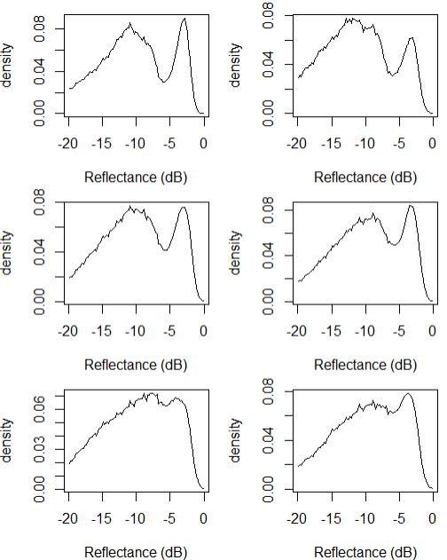

# CrownScorchTLS

This `R` package contains functions to predict crown scorch from Terrestrial 
Lidar scans acquired with a RIEGL vz400i, following methods in Cannon et al. 
2025

The core functionality is to automatically

(1) Isolate crowns of individual trees by removing tree boles from `LAS` objects using `TreeLS::stemPoints`
(2) Generates histograms of relative reflectance to generate predictor variables for model prediction.
(3) Applys a `randomForest` model from Cannon et al. 2025 to estimate crown scorch


Fig. 1. Schematic methodology for estimating canopy scorch volume using terrestrial lidar scans trained on (A) ocular scorch measurements. We (B) manually segmented pre- and post-burn trees for training, (C) isolated crowns, and (D) generated histograms of return intensity. We (E) calculated Δ intensity from changes in pre- and post-burn histograms, and (F) combined these with training data to model canopy scorch using random forests and beta regression. In application, (G) scanned areas can be (H) automatically segmented, (I) crowns isolated and prediction model applied, resulting in (J) individual crown scorch estimates at an operational scale.

## Install required packages

Get the latest released version of `CrownScorchTLS` from github

```
install.packages('remotes')
remotes::install_github('jbcannon/CrownScorchTLS')

```
You will also need `lidR` and `randomForest` packages from CRAN, and the `TreeLS` package from github.

```
install.packages('lidR')
install.packages('randomForest')
remotes::install_github('tiagodc/TreeLS')
```
## Workflow

### Load individual tree as `LAS`

Load a `LAS` object representing a post-burn scan of an individual tree. 
The recommended time since burn is 15-20 days. Model predictions are
based on relative intensity from a RIEGL vz400i terrestrial lidar scanner

```
las_file = system.file('extdata', 'tree_005.laz', package = 'CrownScorchTLS')
las = readLAS(las_file)
plot(las, color='Intensity')
```

Fig. 2. `LAS` representation of Pinus palustris tree D-03-10867 from Cannon et al. 2025, approximately 2 weeks after prescribed burn

### Generate reflectance histogram (optional)
Generate a histogram based on reflectance intensites to be used in `randomForest` prediction

```
crown = remove_stem(las)
histogram = get_histogram(crown)
crown = add_reflectance(crown) # add reflectance since its missing
plot(density ~ intensity, data = histogram, xlab='Reflectance (dB)', type='l')
```

Fig. 3. Histogram of relative reflectance of Pinus palustris crown D-03-10867 from Cannon et al. 2025, approximately 2 weeks after prescribed burn

### Predict scorch from `LAS` object

Predict scorch from post-burn `LAS` object using `randomForest` model from Cannon et al. 2025

```
predict_scorch(las)
```
Model output

```
predicted_scorch
0.03984125
```
### Estimate scorch on multiple trees

The `CrownScorchTLS` package contains data from six example trees following
Cannon et al. 2025 (Figure 3). They can be accessed from the `extdata` directory
in the package

```
directory = system.file('extdata', package = 'CrownScorchTLS')
filenames = list.files(directory, pattern='.laz', full.names=TRUE)

# Run loop to plot all histograms
par(mfrow = c(3,2), mar = c(4,4,1,1))
for(f in filenames) {
  las = readLAS(f)
  scorch = suppressMessages(predict_scorch(las, plot=TRUE))
  cat('file:\t', basename(f), '\t', 'scorch:\t', round(scorch,3),'\n')
}
```
Model output:

```
file:	 tree_001.laz 	 scorch:	 0.051 
file:	 tree_002.laz 	 scorch:	 0.035 
file:	 tree_003.laz 	 scorch:	 0.479 
file:	 tree_004.laz 	 scorch:	 0.577 
file:	 tree_005.laz 	 scorch:	 0.94 
file:	 tree_006.laz 	 scorch:	 0.948
```

Fig. 4. Histograms of lidar return intensity from six longleaf pines with varying degrees of crown scorch


